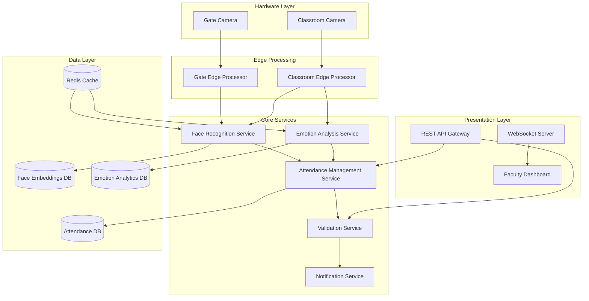

# Smart Attendance System Design Document

## Overview

The Smart Attendance System is a comprehensive AI-powered solution that combines facial recognition, emotion detection, and real-time analytics to automate attendance tracking in educational institutions. The system employs a microservices architecture with separate services for face recognition, emotion analysis, attendance management, and dashboard presentation.

## Architecture

### High-Level Architecture



### Technology Stack

**Backend Services:**
- **Python 3.11+** with FastAPI for high-performance API services
- **OpenCV 4.8+** for computer vision and image processing
- **MediaPipe** for real-time face detection and landmark extraction
- **FaceNet/ArcFace** for face embedding generation and recognition
- **TensorFlow/PyTorch** for emotion classification models
- **Redis** for high-speed caching and session management
- **PostgreSQL** for structured data storage
- **Docker** for containerization and deployment

**Frontend:**
- **React 18** with TypeScript for the faculty dashboard
- **Chart.js/D3.js** for interactive analytics visualization
- **WebSocket** for real-time updates
- **Tailwind CSS** for responsive UI design

**Infrastructure:**
- **NVIDIA Jetson** or similar edge devices for camera processing
- **Kubernetes** for orchestration and scaling
- **NGINX** for load balancing and reverse proxy
- **Prometheus + Grafana** for monitoring and alerting

## Components and Interfaces

### 1. Face Recognition Service

**Responsibilities:**
- Process video streams from gate and classroom cameras
- Extract face embeddings using pre-trained models
- Match faces against enrolled student database
- Implement liveness detection for anti-spoofing

**Key Interfaces:**
```python
class FaceRecognitionService:
    def detect_faces(self, frame: np.ndarray) -> List[FaceDetection]
    def extract_embedding(self, face_roi: np.ndarray) -> np.ndarray
    def match_face(self, embedding: np.ndarray) -> Optional[StudentMatch]
    def verify_liveness(self, face_sequence: List[np.ndarray]) -> bool
```

**Performance Requirements:**
- Process 30 FPS video streams in real-time
- Face recognition accuracy: >95%
- Liveness detection accuracy: >98%
- Maximum processing latency: 2 seconds per face

### 2. Emotion Analysis Service

**Responsibilities:**
- Analyze facial expressions for emotion classification
- Generate engagement scores based on emotion patterns
- Provide real-time emotion statistics

**Key Interfaces:**
```python
class EmotionAnalysisService:
    def analyze_emotion(self, face_roi: np.ndarray) -> EmotionResult
    def calculate_engagement_score(self, emotions: List[EmotionResult]) -> float
    def get_session_statistics(self, session_id: str) -> EmotionStatistics
```

**Emotion Categories:**
- **Interested**: Alert, focused facial expressions
- **Bored**: Drowsy, distracted, or disengaged expressions  
- **Confused**: Frowning, puzzled, or uncertain expressions

### 3. Attendance Management Service

**Responsibilities:**
- Coordinate attendance workflows for day scholars and hostel students
- Manage cross-verification logic
- Generate attendance records and reports

**Key Interfaces:**
```python
class AttendanceService:
    def record_gate_entry(self, student_id: str, timestamp: datetime) -> bool
    def mark_classroom_attendance(self, detections: List[StudentDetection]) -> AttendanceSession
    def validate_day_scholar_attendance(self, student_id: str, session_id: str) -> bool
    def generate_attendance_report(self, session_id: str) -> AttendanceReport
```

**Workflow Logic:**
- **Day Scholars**: Require both gate entry + classroom detection
- **Hostel Students**: Require only classroom detection
- **Validation**: Cross-check detected count vs registered count

### 4. Validation Service

**Responsibilities:**
- Validate attendance accuracy and completeness
- Generate alerts for discrepancies
- Monitor system health and performance

**Key Interfaces:**
```python
class ValidationService:
    def validate_attendance_count(self, session: AttendanceSession) -> ValidationResult
    def check_missing_students(self, session: AttendanceSession) -> List[Student]
    def monitor_system_health(self) -> SystemHealthStatus
```

## Data Models

### Student Model
```python
@dataclass
class Student:
    student_id: str
    name: str
    student_type: StudentType  # DAY_SCHOLAR | HOSTEL_STUDENT
    face_embedding: bytes  # Encrypted embedding
    enrollment_date: datetime
    is_active: bool
```

### Attendance Session Model
```python
@dataclass
class AttendanceSession:
    session_id: str
    class_id: str
    faculty_id: str
    start_time: datetime
    end_time: Optional[datetime]
    total_registered: int
    total_detected: int
    attendance_records: List[AttendanceRecord]
    emotion_statistics: EmotionStatistics
```

### Face Detection Model
```python
@dataclass
class FaceDetection:
    bounding_box: Tuple[int, int, int, int]
    confidence: float
    embedding: np.ndarray
    liveness_score: float
    timestamp: datetime
    camera_location: CameraLocation  # GATE | CLASSROOM
```

### Emotion Result Model
```python
@dataclass
class EmotionResult:
    student_id: str
    emotion: EmotionType  # INTERESTED | BORED | CONFUSED
    confidence: float
    timestamp: datetime
    engagement_score: float
```

## Error Handling

### Camera Connectivity Issues
- **Detection**: Monitor camera feed health every 5 seconds
- **Response**: Switch to backup camera or alert administrators
- **Recovery**: Automatic reconnection with exponential backoff

### Face Recognition Failures
- **Low Confidence Matches**: Flag for manual review if confidence < 85%
- **No Face Detected**: Log incident and continue processing
- **Multiple Faces**: Process each face individually with conflict resolution

### Database Connectivity
- **Connection Loss**: Implement circuit breaker pattern
- **Data Consistency**: Use database transactions for attendance operations
- **Backup Strategy**: Local caching with sync when connection restored

### Performance Degradation
- **High Latency**: Scale processing services horizontally
- **Memory Issues**: Implement garbage collection and memory monitoring
- **CPU Overload**: Queue management with priority processing

## Testing Strategy

### Unit Testing
- **Face Recognition**: Test embedding extraction and matching accuracy
- **Emotion Analysis**: Validate emotion classification with labeled datasets
- **Attendance Logic**: Test cross-verification workflows and edge cases
- **Data Models**: Validate serialization and database operations

### Integration Testing
- **Camera Integration**: Test real camera feeds with various lighting conditions
- **Service Communication**: Validate API contracts between microservices
- **Database Operations**: Test concurrent access and data consistency
- **Real-time Updates**: Verify WebSocket communication and dashboard updates

### Performance Testing
- **Load Testing**: Simulate multiple concurrent camera streams
- **Stress Testing**: Test system behavior under high student volumes
- **Latency Testing**: Measure end-to-end processing times
- **Memory Testing**: Monitor memory usage under sustained load

### Security Testing
- **Anti-Spoofing**: Test liveness detection with various attack vectors
- **Data Encryption**: Validate face embedding encryption and storage
- **Access Control**: Test authentication and authorization mechanisms
- **Privacy Compliance**: Ensure no raw facial images are stored

### Acceptance Testing
- **Accuracy Validation**: Test attendance accuracy in real classroom scenarios
- **User Experience**: Validate faculty dashboard usability and responsiveness
- **Edge Cases**: Test system behavior with partial occlusion, poor lighting
- **Cross-Verification**: Validate day scholar workflow accuracy